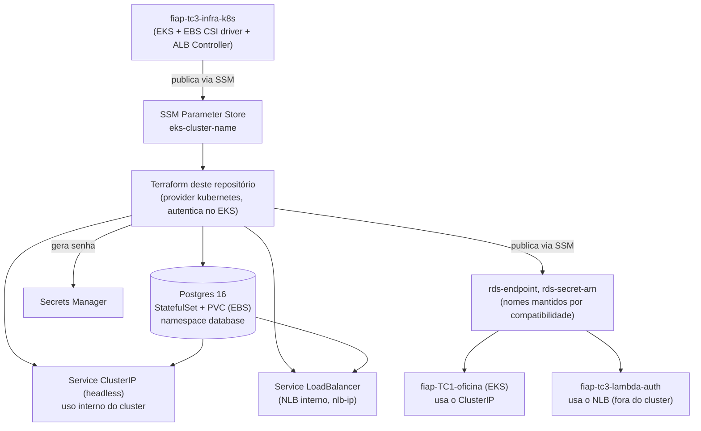

# fiap-tc3-infra-db

Infraestrutura como código (Terraform) do banco de dados do Tech Challenge Fase 3 (SOAT/FIAP). Repositório 3 dos 4 exigidos pelo desafio.

## Propósito

Provisionar o **Postgres** para a [aplicação principal](../fiap-TC1-oficina), substituindo o Postgres que rodava como Deployment "cru" dentro do próprio cluster Kubernetes (usado na Fase 2) por um provisionamento declarativo, com credenciais geradas e guardadas no Secrets Manager em vez de hardcoded.

Justificativa completa da escolha do banco (PostgreSQL) e do modelo relacional: [`docs/RFC-001-escolha-banco-de-dados.md`](../fiap-TC1-oficina/docs/RFC-001-escolha-banco-de-dados.md) e diagrama ER em [`docs/ER-diagrama.md`](../fiap-TC1-oficina/docs/ER-diagrama.md), ambos no repositório da aplicação principal.

## Por que não é RDS

A intenção original era **Amazon RDS PostgreSQL** (banco totalmente gerenciado pela AWS). A conta usada neste desafio é um **AWS Academy Learner Lab** (fornecida pela FIAP), cuja política de curso bloqueia `rds:CreateDBInstance` por completo — nem uma instância RDS clássica, nem a instância dentro de um cluster Aurora Serverless (é a mesma API por baixo dos panos; confirmado testando o `terraform apply` real). Aurora Serverless v1 (que dispensaria essa API) também não está disponível para `aurora-postgresql` nesta conta.

Diante disso, o Postgres roda como **`StatefulSet` dentro do cluster EKS** provisionado por [`fiap-tc3-infra-k8s`](../fiap-tc3-infra-k8s) — mesma engine, mesmo schema, zero mudança na aplicação ou na Lambda. Ver a nota de implementação em [RFC-001](../fiap-TC1-oficina/docs/RFC-001-escolha-banco-de-dados.md).

## Tecnologias

| Tecnologia | Finalidade |
|---|---|
| Terraform (`kubernetes`, `random`, `aws`) | Provisionamento declarativo do Postgres dentro do EKS |
| `StatefulSet` + PVC (EBS via CSI driver) | Postgres com armazenamento persistente |
| AWS Secrets Manager | Credenciais do banco (usuário/senha gerados por `random_password`) |
| AWS SSM Parameter Store | Publica endpoint/secret para os outros 3 repositórios consumirem sem acesso ao state deste |
| GitHub Actions | CI/CD |

## Arquitetura



Por que dois `Service` diferentes: a aplicação principal roda dentro do mesmo cluster EKS e alcança o Postgres por um `ClusterIP` normal. A Lambda de autenticação roda **fora** do cluster, na sua própria ENI dentro da VPC — ela não alcança um `ClusterIP` (que só existe via as regras de iptables dos nós), por isso precisa de um endereço com presença real na VPC: um Network Load Balancer **interno**, criado pelo AWS Load Balancer Controller já provisionado em `fiap-tc3-infra-k8s`.

Os nomes dos parâmetros SSM publicados (`rds-endpoint`, `rds-secret-arn`) foram mantidos iguais aos que um RDS geraria — só o valor por trás mudou — para que `fiap-tc3-lambda-auth` e o pipeline de deploy de `fiap-TC1-oficina` não precisassem de nenhuma alteração.

**Trade-off assumido** (documentado em [ADR-004](../fiap-TC1-oficina/docs/ADR-004-rds-master-user-compartilhado.md) no repositório principal): a aplicação e a Lambda usam o mesmo *master user* do banco, em vez de um usuário de aplicação com permissões restritas. Simplifica o provisionamento para o escopo do desafio; em produção real o recomendado seria criar um usuário de aplicação via script pós-provisionamento com apenas `SELECT/INSERT/UPDATE/DELETE` nas tabelas da oficina.

## Rede

Este repositório **não cria VPC nem Security Group próprios** — o Postgres roda dentro da rede do cluster EKS (VPC/subnets criadas por [`fiap-tc3-infra-k8s`](../fiap-tc3-infra-k8s)). A única dependência lida via SSM é `eks-cluster-name`, usada para o provider `kubernetes` autenticar no cluster (mesmo padrão de token de curta duração do próprio `fiap-tc3-infra-k8s`) — por isso esse repositório precisa ser aplicado **primeiro**.

## Deploy

Pré-requisitos: conta AWS, `terraform` >= 1.5, e o repositório `fiap-tc3-infra-k8s` já aplicado (cluster + EBS CSI driver + ALB Controller no ar).

```bash
cd terraform
terraform init
terraform apply -var="ambiente=homologacao"
```

O job `validate` do CI/CD (`terraform fmt` + `terraform validate`) roda em todo push/PR e não depende de credenciais AWS. O job `apply` só roda quando a variável de repositório `DEPLOY_TO_AWS=true` estiver configurada.

> **Nota AWS Academy Learner Lab:** neste desafio, o job `apply` (que assumiria uma role AWS via GitHub OIDC) não é viável — criar a role/OIDC provider para isso também é bloqueado pela política do curso. O deploy real foi feito rodando `terraform apply` localmente, com credenciais de sessão obtidas no painel do Learner Lab (válidas por poucas horas). O pipeline continua correto e pronto para uma conta AWS sem essa restrição — segredos/variáveis necessários para habilitar: secret `AWS_ROLE_ARN` (OIDC) e variável `AWS_REGION`.

Branch `main` protegida, merge só via Pull Request; push em `main` aplica em produção, push em `homologacao` aplica em homologação.
