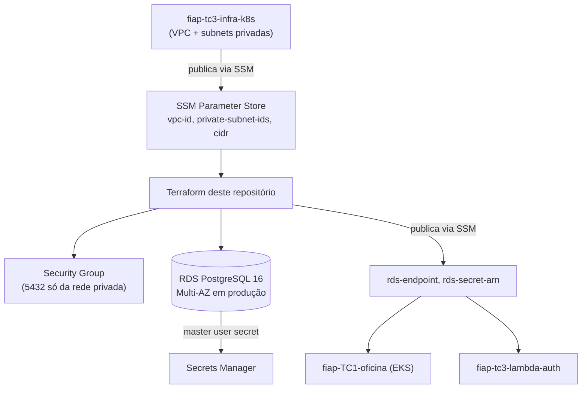

# fiap-tc3-infra-db

Infraestrutura como código (Terraform) do banco de dados gerenciado do Tech Challenge Fase 3 (SOAT/FIAP). Repositório 3 dos 4 exigidos pelo desafio.

## Propósito

Provisionar um **Amazon RDS PostgreSQL** para a [aplicação principal](../fiap-TC1-oficina), substituindo o Postgres que rodava como Deployment dentro do próprio cluster Kubernetes (usado na Fase 2). Um banco gerenciado dá backup automático, patching, Multi-AZ e credenciais rotacionadas pela AWS — sem a oficina precisar operar isso manualmente.

Justificativa completa da escolha do banco (PostgreSQL) e do modelo relacional: [`docs/RFC-001-escolha-banco-de-dados.md`](../fiap-TC1-oficina/docs/RFC-001-escolha-banco-de-dados.md) e diagrama ER em [`docs/ER-diagrama.md`](../fiap-TC1-oficina/docs/ER-diagrama.md), ambos no repositório da aplicação principal.

## Tecnologias

| Tecnologia | Finalidade |
|---|---|
| Terraform | Provisionamento declarativo |
| Amazon RDS (PostgreSQL 16) | Banco gerenciado |
| AWS Secrets Manager | Credenciais mestras (rotação gerenciada pela própria AWS via `manage_master_user_password`) |
| AWS SSM Parameter Store | Publica endpoint/secret para os outros 3 repositórios consumirem sem acesso ao state deste |
| GitHub Actions | CI/CD |

## Arquitetura



**Trade-off assumido** (documentado em ADR-004 no repositório principal): a aplicação e a Lambda usam o mesmo *master user* do RDS, em vez de um usuário de aplicação com permissões restritas. Simplifica o provisionamento para o escopo do desafio; em produção real o recomendado seria criar um usuário de aplicação via script pós-provisionamento com apenas `SELECT/INSERT/UPDATE/DELETE` nas tabelas da oficina.

## Rede

Este repositório **não cria VPC** — ele lê `vpc-id`, `private-subnet-ids` e `private-subnets-cidr` publicados no SSM Parameter Store pelo repositório [`fiap-tc3-infra-k8s`](../fiap-tc3-infra-k8s), que precisa ser aplicado primeiro.

## Deploy

Pré-requisitos: conta AWS, `terraform` >= 1.5, e o repositório `fiap-tc3-infra-k8s` já aplicado (para existirem os parâmetros SSM de rede).

```bash
cd terraform
terraform init
terraform apply -var="ambiente=homologacao"
```

O job `validate` do CI/CD (`terraform fmt` + `terraform validate`) roda em todo push/PR e não depende de credenciais AWS. O job `apply` só roda quando a variável de repositório `DEPLOY_TO_AWS=true` estiver configurada — hoje ainda não está, porque a conta AWS do desafio está pendente de liberação de crédito pela FIAP. Segredos/variáveis necessários para habilitar: secret `AWS_ROLE_ARN` (OIDC) e variável `AWS_REGION`.

Branch `main` protegida, merge só via Pull Request; push em `main` aplica em produção, push em `homologacao` aplica em homologação.
